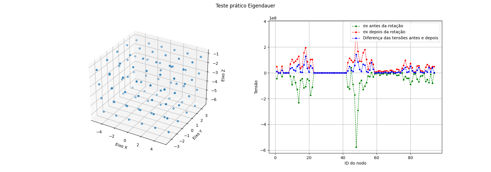

<br />
<p align="center">
  <h2 align="center">Teste prático</h2>
  </p>
</p>

<p align="center">Programação Python para Projeto PIPE I – Eigendauer</p>


<!-- TABLE OF CONTENTS -->
<details open="open">
  <summary>Estrutura do README</summary>
  <ol>
    <li>
      <a href="#objetivo">Objetivo</a>
    </li>
    <li>
      <a href="#requisitos">Requisitos</a>
      <ul>
        <li>Dependências</li>
        <li>Utilização</li>
      </ul>
    </li>
    <li>
      <a href="#resultado-esperado">Resultado esperado</a>
    </li>
    <li><a href="#organização-dos-arquivos-do-código-fonte">Organização dos arquivos do código fonte</a></li>
  </ol>
</details>
<br />

## Objetivo
> Esse teste prático tem como objetivo verificar skills de programação em Python considerando o escopo de projeto que será desenvolvido ao longo do projeto PIPE I.
<br />

## Requisitos
> O teste foi implementado utilizando-se a versão 3.10.7 do Python.

### Dependencias

* Openpyxl 3.0.10 -> Biblioteca para importar dados de planilhas 
* matplotlib 3.5.3 -> Bibliteca para plotagem de gráficos
* numpy 1.23.3 -> Biblioteca utilizada para operação de matrizes

### Utilização
Para que o código implementado execute as tarefas adequadamente, é necessario que os arquivos ***stress.xlsx*** e ***node.xlsx*** estejam presentes no diretório do código fonte.

Para conferir o teste, basta executar o arquivo *main.py* utilizando o comando abaixo:
```
python main.py
```

<br />

## Resultado esperado
Os gráficos resultante do teste é mostrado na figura abaixo:


> *⚠ Observação 1:*  
> No código implementado foi utilizado dicionários para armazenar valores dos nós, porém a solução mais adequada seria a criação de uma classe para evitar possíveis confusões com as chaves dos dicionários.

> *⚠ Observação 2:*  
> Durante a implementação do código, foram encontradas algumas dificuldades nas operações matemáticas e há grande possibilidade de haver alguma inconsistência nos resultados. 

## Organização dos arquivos do código fonte

A seguir, uma breve apresentação dos arquivos presentes no diretório do código:

### Diretório do código fonte

    .
    ├── ...
    ├── main.py                 # Código principal
    ├── definitions.py          # Código com definições de variáveis
    ├── utils.py                # Código com funções implementadas para o teste
    ├── node.xlsx               # Arquivo com os nodos para plotagem 3D
    ├── stress.xlsx             # Arquivo com nodos para cálculo de tensão
    ├── result.png              # Figura com a plotagem dos gráficos
    └── readme.md


